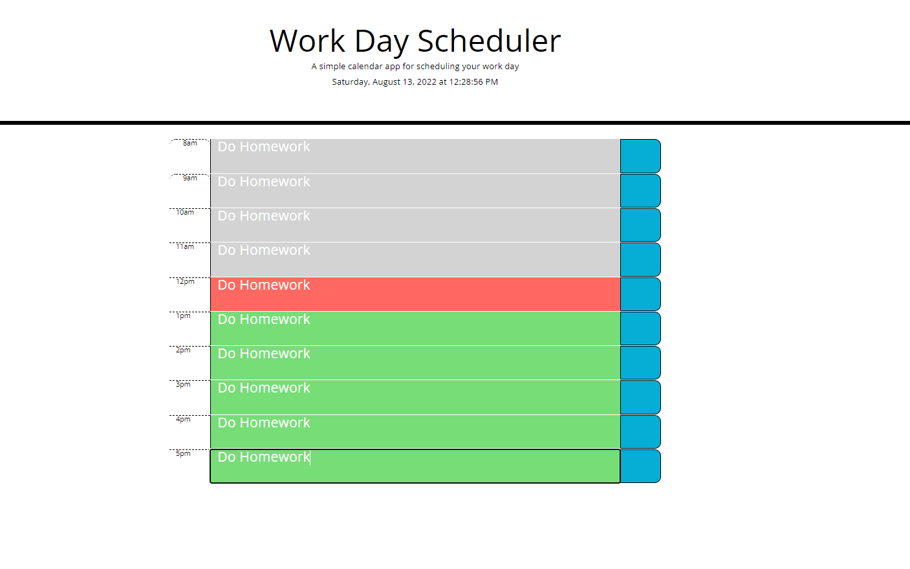

# myDayScheduler
## Description

This project was build with Bootstrap and jQuery API libraries. The standard container, row, column method of Bootstrap was uses to organize the layout of the html elements. jQuery methods such as, text(), eq(), and addClass(), were used for dom manipulation and traversal. Javascript prototype inheritance was used specifically with the Date() method. The Data() method was used to get the current time and display it the screen. To display the time as a clock I used the seInterval() callback function which updated the time every 1000ms. To persist the event data within the day scheduler app, the input text was stored into localStorage and on refresh the items were put back to their correct locations.       

## Installation

Access to repository here:
[Repository url](https://github.com/myang5t3r/myDayScheduler)

Live Deployment here:
[https://myang5t3r.github.io/myDayScdeduler/](https://myang5t3r.github.io/myDayScheduler/)

## Usage
The usages of this project is for informational and learning purposes only.  
 
 
